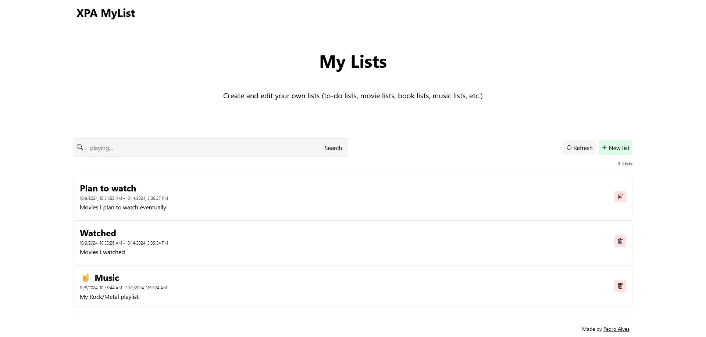

# MyList

MyList allows you to create and edit your own lists (to-do lists, movie lists, book lists, music lists, etc.)  

## Installation

### Prerequisites

#### Docker setup:

- [Docker](https://www.docker.com/)

#### Manual setup:

- [.NET 8](https://dotnet.microsoft.com/en-us/download/dotnet/8.0)
- EF Core CLI tools (`dotnet tool install --global dotnet-ef`)
- [Node.js 20+](https://nodejs.org/en)
- [Optional] [Nginx](https://nginx.org/en/)

### Run (Docker)

Running with docker is as simple as running one command.  

1. [Optional] Edit the configurations to your liking (nginx, Dockerfiles, etc.)
2. Run `docker compose up -d --build`

### Run (Manual)

If you don't have docker or wish to run `MyList` manually, follow the steps below.  
You should configure Nginx to proxy the requests if you want to use it on another device (i.e.: other than `localhost`, e.g.: your phone).  

#### Web application

Working directory: `mylist.client`

1. Install dependencies with `npm install --production`
2. Set environment variable `API_BASE_URL=http://localhost:5000/mylist-api/**`
3. Build project with `npm run build`
4. Run with `node .output/server/index.mjs`

You should now be able to view the page at `localhost:3000`.  

#### API

Working directory: `MyList.Server`

1. Build project with `dotnet publish -c Release -o publish`
2. Copy the fresh database file `mylist.db`* (or make your own with `dotnet ef database update`) to the `publish` folder
3. Enter the `publish` directory with `cd publish`
4. Run with `dotnet MyList.Server.dll`

You should now be able to access the API at `localhost:5000`.  

\* This file is located in the repository's base folder `data`.  
